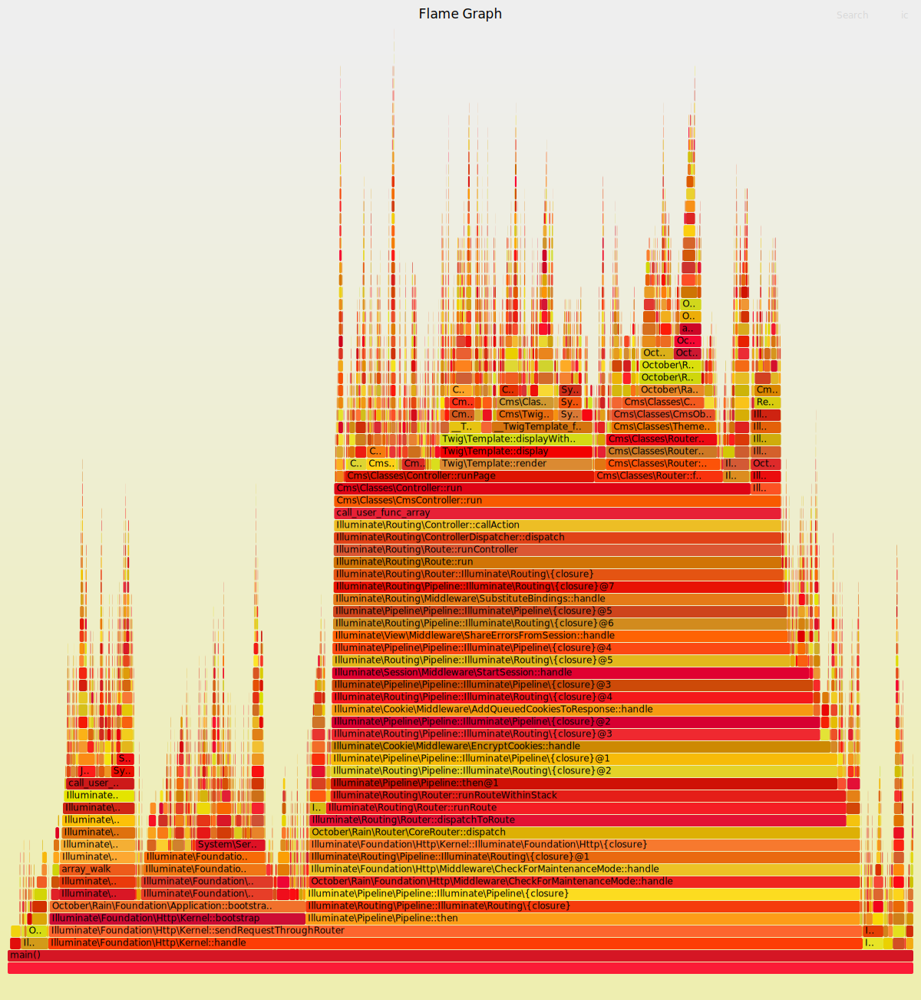

# Generate PHP FlameGraphs with xhprof.  

A script to convert a directory of xhprof sampling files to a format that can be read by Brendan Gregg's [FlameGraph](https://github.com/brendangregg/FlameGraph) script.

forked from [msonnabaum/xhprof-flamegraphs](https://github.com/uzulla/xhprof-flamegraphs).

## Notice

The script support only sampling data that generate by `xhprof_sample_enable`.

> I tested with [https://github.com/longxinH/xhprof](https://github.com/longxinH/xhprof). + PHP 7.4.9

# example



# Usage

## Setup xhprof.

First, install [xhprof](https://github.com/longxinH/xhprof.git) .

```
$ git clone  https://github.com/longxinH/xhprof.git
$ cd xhprof/extension/
$ phpize
$ ./configure
$ make && sudo make install
```

```
$ php -i |grep xhprof

xhprof
xhprof support => enabled
(snip)
```

```
$ mkdir -p /tmp/xhprof/
```

## Insert `xhprof_sample_enable` to your code.

Next, Insert this code to `index.php` (or top of somewhere) .

```php
<?php
ini_set("xhprof.output_dir", "/tmp/xhprof");
ini_set("xhprof.sampling_interval", "100"); // default 100000
require_once('/path/to/xhprof/xhprof_lib/utils/xhprof_runs.php');
xhprof_sample_enable();

register_shutdown_function(function () {
    $runs = new XHProfRuns_Default();
    $runs->save_run(xhprof_disable(), (string)microtime(true));
});
``` 


## Go sampling, Generate `*.xhprof`s.

```
# reset profile data.
$ rm /tmp/xhprof/*

# If you want to get accurate flame graph, You needs alot of access.
$ ab -n 1000 http://your-host.test/

$ ls /tmp/xhprof/
5f9eec64c02d1.1604250724.7871.xhprof ... 1000 files.
...
```

## Draw the flame graph from the data.

```
$ git clone git@github.com:brendangregg/FlameGraph.git
$ xhprof-sample-to-flamegraph-stacks /tmp/xhprof | FrameGraph/flamegraph.pl > flamegraph.svg

# open flamegraph with your browser(ex: google chrome)
```

## Note: You have to erase all `*.xhprof`, when update codes.

`xhprof-sample-to-flamegraph-stacks` converts tons of sampling files to one svg.

If exists old samples, be mixed together.

